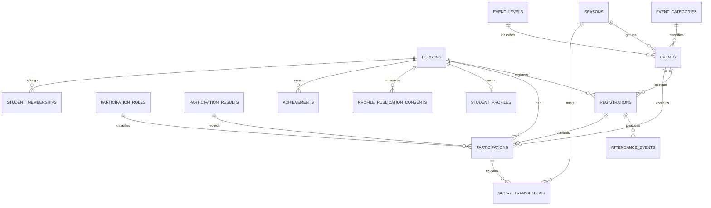

# Контур активности и достижений

## 1. Назначение

MosActive — модуль платформы EventKAIT20 вместе с Web и Scanner. Контур
использует общие записи людей, мероприятий, регистраций и посещений:

- Registration означает поданную заявку;
- AttendanceEvent означает факт или попытку отметки входа;
- Participation означает подтверждённое фактическое участие и только оно может
  стать основанием для баллов.

Person остаётся единым идентификатором человека. Исторические данные Registration
и неизменяемая история баллов не переписываются при изменении текущего профиля.

## 2. Модель

Основные роли участия поставляются как системные справочники: участник,
конкурсант, волонтёр, организатор, спикер, наставник и капитан. Их можно дополнять
без изменения исходного кода. Результат участия хранится отдельным справочником
и не смешивается с ролью.

## 3. Классификация и сезоны

Event может ссылаться на Season, EventCategory и EventLevel. Эти связи nullable:
старые мероприятия продолжают работать без обратного заполнения. Одновременно
активен не более одного сезона; ограничение обеспечивается MySQL.

StudentMembership хранит исторические snapshot-значения `study_group`,
`department` и `course`, а также нормализованные ссылки на Organization,
Department и StudyGroup. Историческая принадлежность отображается по сохранённым
snapshot-значениям: переименование текущей группы или отделения не переписывает
историю. Нормализованные IDs используются для структурных связей, агрегации,
поиска связанного справочника и дальнейшей нормализованной обработки. Новая
membership создаётся только по `studyGroupId`; Organization, Department и course
выводятся backend из доверенного tenant context. Для безопасно неразрешимых legacy
строк normalized IDs и course временно могут быть NULL и требуют отдельной
сверки — название группы не парсится.

Периоды одного Person не пересекаются: backend сериализует создание через блокировку
Person и возвращает `MEMBERSHIP_PERIOD_OVERLAP`. При начислении по Participation
выбирается единственный membership, действующий на локальную календарную дату
мероприятия: UTC-момент `Event.start_at` сначала переводится в `Europe/Moscow`,
после чего берётся дата. Его `membership_id` сохраняется в ScoreTransaction.
Отсутствие membership не блокирует
личные баллы, но исключает проводку из группового/отделенческого рейтинга. Несколько
подходящих периодов не выбираются случайно и фиксируются аудитом как ошибка качества
данных. MANUAL_ADJUSTMENT и LEGACY_IMPORT не получают принадлежность автоматически.

## 4. Начисление баллов

ScoringRule выбирается на дату `Event.start_at`, а не на дату подтверждения:
сначала больший priority, затем более
специфичное совпадение сезона, категории, уровня, роли и результата. Если два
лучших правила равнозначны, начисление блокируется с `SCORING_RULE_AMBIGUOUS`.
Отсутствие правила не блокирует Participation: оно получает состояние `NO_RULE`.

ScoreTransaction — неизменяемый журнал. Повторное подтверждение защищено
idempotency key и уникальным циклом начисления. Изменение роли или результата
компенсирует прежнее начисление REVERSAL-записью и выполняет новый расчёт.
Отмена не удаляет историю. Ручная корректировка доступна только SUPER_ADMIN,
требует причину и попадает в аудит.

Для новых Events явное завершение или автоматический переход через 24 часа после
`end_at` создаёт `EventParticipationReview` для каждой активной регистрации.
Роль по умолчанию — PARTICIPANT; ранее назначенные роль и результат сохраняются.
Статус завершения баллов не начисляет. SUPER_ADMIN или ORGANIZER корректирует
посещаемость, роль, результат и связь с контингентом, затем утверждает ведомость.
Начисление всех пришедших сопоставленных студентов выполняется в одной
транзакции; неподходящие правила блокируют утверждение целиком. Прямое
подтверждение участия для новых Events заблокировано кодом `USE_EVENT_REVIEW`.
Старые Events сохраняют прежний API и исторические начисления.

Правила одинаковой размерности и приоритета могут сосуществовать только в
непересекающихся полуоткрытых периодах `[valid_from, valid_to)`. Все CREATE,
PATCH и DEACTIVATE сначала блокируют запись Season и только затем затрагиваемые
ScoringRule; `season_id` существующего правила через PATCH не изменяется. PATCH
создаёт новую версию и закрывает период предыдущей на границе начала новой, не
деактивируя историческую версию. Если граница находится в прошлом и у заменяемой
версии уже есть AWARD для Event на границе или после неё, операция отклоняется с
`SCORING_RULE_RETROACTIVE_CONFLICT`: автоматический пересчёт истории не выполняется.
Уже начисленные баллы сохраняют snapshot версии правила. Ручная корректировка
идемпотентна по requestId только
для идентичного набора personId, seasonId, points и reason; повторное использование
ключа с другим смыслом возвращает `IDEMPOTENCY_KEY_REUSED` без нового аудита.

ScoringRule, срок действия которого уже начался, нельзя выключить из исторического
поиска: deactivate означает retirement — `valid_to` закрывается текущим UTC-моментом,
а `active=true` сохраняется. Поэтому delayed Participation выбирает ту же
историческую версию по `Event.start_at`, но новые Event после границы её уже не
получают. Полностью перевести в `active=false` можно только будущее правило, ещё не
вступившее в действие и не имеющее AWARD. PATCH с `active=false` запрещён; retirement
выполняется только через deactivate endpoint.

## 5. Администрирование и права

- SUPER_ADMIN управляет сезонами, справочниками, глобальными правилами,
  публикацией профилей и ручными корректировками;
- ORGANIZER подтверждает/отменяет участие и назначает роль/результат;
- SCANNER продолжает создавать AttendanceEvent и не имеет доступа к Activity API.

Подтверждение без отметки Scanner требует отдельного флага, явного предупреждения
в интерфейсе и причины, сохраняемой в аудите. Массовые операции выполняются
транзакционно и безопасны при повторном запросе.

## 6. Публичный профиль и приватность

Профиль по умолчанию PRIVATE. Публичный доступ использует случайный publicSlug,
а не Person ID. Для LINK_ONLY/PUBLIC необходима действующая запись согласия с
версией, временем, источником и белым списком разрешённых полей. Отзыв согласия
сразу переводит профиль в PRIVATE.

Публичные ответы никогда не содержат email, телефон, внутренний Person ID,
внутренние причины корректировок или служебные идентификаторы транзакций.
Личный рейтинг включает только PUBLIC-профили с NAME и SCORES. Поля
`confirmedParticipations` и `achievements` полностью отсутствуют без отдельных
PARTICIPATIONS/ACHIEVEMENTS. Оба счётчика относятся только к выбранному Season;
непривязанные к Event/Participation достижения в сезонный счётчик не входят.
Публичные групповые и отделенческие рейтинги учитывают только PUBLIC-профили с
действующим согласием на SCORES и только проводки с историческим membership_id.
Малые агрегированные выборки пока не защищены k-anonymity; это отдельный privacy
gate перед внешним публичным запуском.

Историческая StudentMembership отображает сохранённые на период значения группы,
отделения и курса, а не текущие названия справочников. Нормализованные ссылки
могут отсутствовать у legacy-записи; такая запись остаётся видимой и пригодной
для Digital Dossier и диагностики, а неизвестный курс не выводится из имени
группы.

## 7. Интеграционные события

В той же транзакции, что и бизнес-изменение, в `domain_outbox` записываются
события подтверждения/отмены Participation, изменения видимости профиля и
подтверждения Achievement. Отправка во внешнюю систему намеренно не входит в
текущий этап; запись outbox предотвращает потерю будущих событий.

## 8. Совместимость и эксплуатация

Миграция `013_active_foundation.sql` только добавляет таблицы, индексы, nullable
связи Event и безопасные справочные значения. Она совместима с MySQL 8.1.0.
Существующие Registration, Attendance, Scanner, QR и offline sync не меняют
семантику. Корректирующая миграция `014_activity_integrity.sql` добавляет
ScoreTransaction.membership_id, уникальный generated key активного согласия и
заменяет чрезмерно строгую уникальность scoring-rule match key на индекс; конфликт
периодов защищается сервисом под блокировкой Season.

Архивирование — штатный способ скрыть завершённый Event. Permanent purge разрешён
только Event без любой Participation (включая DRAFT), связанной ScoreTransaction
или Achievement. Иначе API возвращает `EVENT_HAS_ACTIVITY_HISTORY`; неизменяемый
Score Ledger и Activity audit не удаляются обычной бизнес-операцией.

Демонстрационные Season, классификация и правило на 10 баллов создаются только
development seed, который по-прежнему запрещён вне development.
